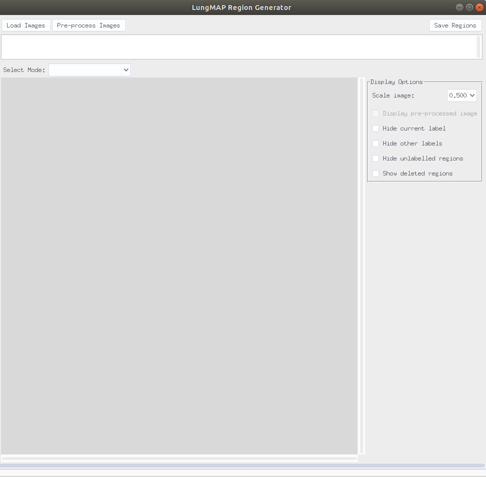

## GUI Instructions
1. Ensure you have `python` installed on your machine.  
    a. Go to a `terminal emulator`.  
    b. Type in `python`.  
    c. If you are redirected to the app store, download python 3.  
    
2. Ensure you have `git` install on your machine.  
    a. Go to a `terminal emulator`.  
    b. Type in `git`.  
    c. If you are redirected to the app store, download and install git.  
    
3. Open a `terminal emulator`.  

4. Clone the source code for the application.  
    a. With the open `terminal emulator`.  
    b. `git clone https://github.com/duke-lungmap-team/lungmap-pipeline.git`
    c. `cd lungmap-pipeline/gui`
    d. Install the necessary requirements: `pip install -r requirements.txt`

5. Execute the program.  
    a. Ensure your `terminal emulator` is open and pointing within `lungmap-pipeline/gui`.  
    b. `python lungmap_pipeline.py`
    
6. If everything went well you should see the following image:

